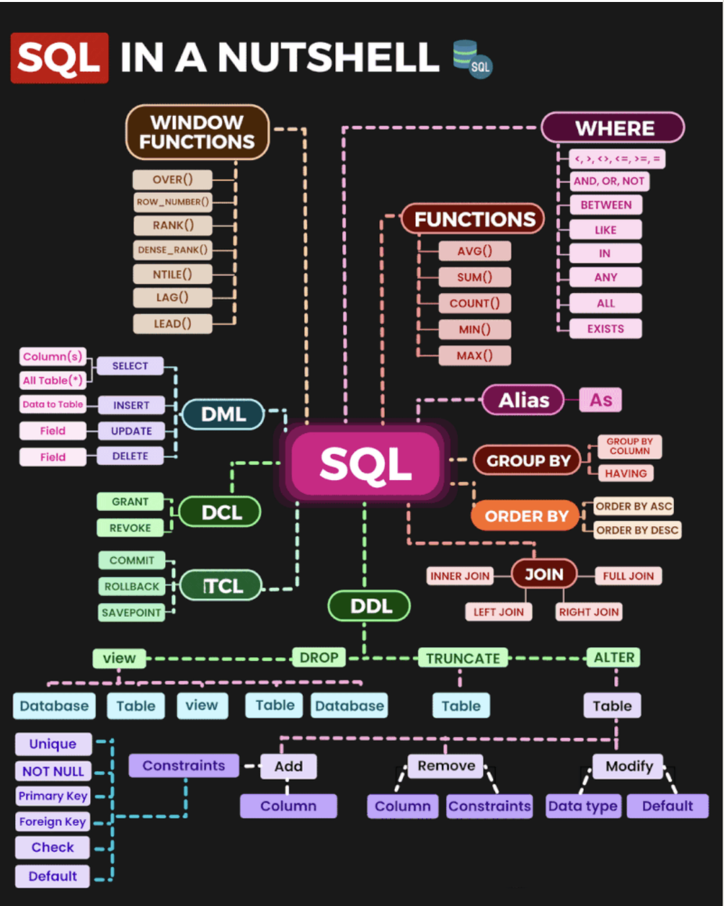

# sql
SQL stands for Structured Query Language. It is a domain-specific programming language used for managing and manipulating relational databases. SQL provides a standardized way to interact with databases, allowing users to perform tasks such as querying data, inserting, updating, and deleting records, creating and modifying database schemas, and more.

Key components and operations in SQL include:

**Queries**: SQL allows you to retrieve data from a database using SELECT statements. These queries can be simple, retrieving specific data, or complex, involving multiple tables and conditions.

**Data Manipulation**: SQL provides commands for adding, updating, and deleting data in a database. These commands include INSERT, UPDATE, and DELETE statements.

**Data Definition**: SQL also supports the creation, modification, and deletion of database structures. You can create tables, define their structure (columns and data types), establish relationships between tables, and set constraints to maintain data integrity.

**Data Control**: SQL includes commands for managing user access and permissions to the database. This includes granting or revoking privileges like SELECT, INSERT, UPDATE, DELETE, and others.

**Transactions**: SQL supports the concept of transactions, which allows you to group a series of SQL statements into a single unit of work. Transactions ensure the integrity and consistency of data by allowing you to either commit the changes or roll them back in case of errors or failures.

### views
A view is a database object in SQL that represents the result of a SELECT query on one or more tables. It's a virtual table that does not store data itself but provides a way to access and present data from one or more tables in a structured manner. Here's a detailed explanation of the role of views in SQL:

**Data Abstraction**: Views allow you to abstract or hide the underlying complexity of the database schema from users or applications. Instead of directly querying multiple tables, you can create a view that joins these tables and presents a simplified, logical representation of the data.

**Data Security**: Views can be used to restrict access to certain columns or rows of a table. By creating views with specific filters or selecting only certain columns, you can control what data users or applications can see, ensuring data security and privacy.

**Simplifying Queries**: Views make it easier to write and maintain complex queries. You can encapsulate complex JOIN operations, calculations, or transformations in a view, which can then be queried just like a regular table. This simplifies the SQL queries that need to be written by application developers.

**Code Reusability**: Views promote code reusability. Instead of duplicating complex SQL logic in multiple parts of an application, you can create a view and reuse it across different queries, reducing redundancy and potential maintenance issues.

**Performance Optimization**: In some cases, views can improve query performance. The database optimizer can cache the results of a view, reducing the need for complex calculations or joins in subsequent queries.

**Data Integrity**: Views can be used to enforce data integrity rules. For example, you can create an "INSERTABLE VIEW" that allows users to insert data into a view but not directly into the underlying tables. This ensures that data inserted through the view adheres to specific business rules.

**Change Management**: If the underlying table structure changes, you can often update the view definition to reflect these changes without affecting the queries that use the view. This separation between the logical view and physical tables simplifies database maintenance.

**Reporting and Analysis**: Views are commonly used in reporting and business intelligence applications. They provide a consistent and simplified way to access data for reporting and analysis purposes.
